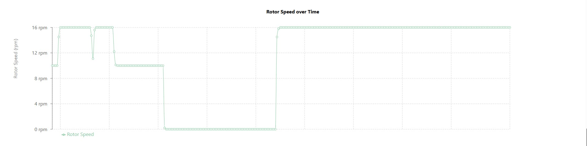

# Turbine Data Visualization Application

This project provides a full-stack application to visualize wind turbine data. The backend is a FastAPI application that serves time-series data from a MongoDB database, and the frontend is a React application that displays the data in interactive charts.

## Table of Contents

- [Turbine Data Visualization Application](#turbine-data-visualization-application)
  - [Table of Contents](#table-of-contents)
  - [Features](#features)
  - [Project Structure](#project-structure)
  - [Getting Started](#getting-started)
    - [Prerequisites](#prerequisites)
    - [Configuration](#configuration)
    - [Backend Setup](#backend-setup)
    - [Frontend Setup](#frontend-setup)
  - [Data Preparation](#data-preparation)
  - [Status Reporting](#status-reporting)
  - [API Usage](#api-usage)
  - [Data Dictionary](#data-dictionary)
  - [Example Visualizations](#example-visualizations)
    - [Rotor vs. Wind: A Deeper Look](#rotor-vs-wind-a-deeper-look)
    - [Rotor vs. Power: A Deeper Look](#rotor-vs-power-a-deeper-look)
    - [Additional Charts](#additional-charts)
  - [Summary of Turbine Behavior](#summary-of-turbine-behavior)

## Features

- **FastAPI Backend**: A high-performance backend for serving turbine data.
- **MongoDB Integration**: Stores and retrieves time-series data efficiently.
- **React Frontend**: An interactive user interface for data visualization.
- **Dynamic Charting**: Displays key turbine performance indicators over time.
- **RESTful API**: A clean and well-documented API for data access.
- **Status Reporting**: Includes sample reports of data points where the turbine status is not normal (i.e., status code is not zero).

## Project Structure

```
turbine/
├── data/
│   ├── reports/             # Sample reports (e.g., non-normal status)
│   └── ...                  # Other sample data and chart images (ignored by git)
├── turbine/               # Python virtual environment
├── web-app/
│   └── client/            # React frontend application
├── .env.example           # Example environment file
├── .gitignore             # Git ignore file
├── load_csv_to_mongo.py   # Script to load data into MongoDB
├── main.py                # FastAPI application entry point
└── README.md              # This file
```

## Getting Started

Follow these instructions to get the application up and running on your local machine.

### Prerequisites

- [Python 3.8+](https://www.python.org/downloads/)
- [Node.js and npm](https://nodejs.org/en/download/)
- [MongoDB](https://www.mongodb.com/try/download/community)

### Configuration

Before running the application, you need to configure the data paths.

1.  **Create a `.env` file**:
    This project uses a `.env` file to manage environment variables. Create a copy of `.env.example` and name it `.env`.

    ```bash
    cp .env.example .env
    ```

2.  **Edit the `.env` file**:
    Open the `.env` file and ensure the paths to the CSV files are correct.  they are set to:
    ```
    TURBINE1_CSV_PATH=Turbine1.csv
    TURBINE2_CSV_PATH=Turbine2.csv
    ```
    You can also change the `MONGO_URI` if your MongoDB instance is running on a different address.

### Backend Setup

1.  **Install Dependencies**:
    Navigate to the project root and install the required Python packages.
    ```bash
    pip install -r requirements.txt
    ```

2.  **Load Data into MongoDB**:
    Make sure your MongoDB instance is running, then execute the following script to load the data from the CSV files specified in your `.env` file.
    ```bash
    python load_csv_to_mongo.py
    ```

3.  **Run the FastAPI Server**:
    Start the API server from the project root.
    ```bash
    uvicorn main:app --reload
    ```
    The API will be available at `http://127.0.0.1:8000`.

### Frontend Setup

1.  **Navigate to the Client Directory**:
    ```bash
    cd web-app/client
    ```

2.  **Install Dependencies**:
    ```bash
    npm install
    ```

3.  **Configure Frontend Environment**:
    Create a `.env` file in the `web-app/client` directory and add the following line to connect the frontend to the backend API:
    ```
    REACT_APP_API_URL=http://127.0.0.1:8000
    ```

4.  **Run the React Application**:
    ```bash
    npm start
    ```
    The application will open in your browser at `http://localhost:3000`.

## Data Preparation

The `load_csv_to_mongo.py` script handles the crucial task of preparing the raw CSV data and loading it into MongoDB. Here’s how it works:

1.  **Time-Series Collection Creation**:
    For each CSV file specified in your `.env` file, the script first creates a dedicated **time-series collection** in MongoDB. This specialized collection type is optimized for storing and querying data points that change over time. It uses the `timestamp` field as the primary time-based index.

2.  **Header Normalization**:
    The script reads the CSV file using the first row as the header but skips the second row, which typically contains unit information. It then normalizes the column headers by:
    - Stripping any leading or trailing whitespace.
    - Renaming the first column (e.g., `Dat/Zeit`) to `timestamp` to align with the time-series collection requirements.

3.  **Data Type Conversion**:
    The `timestamp` column is converted from a string format (e.g., `dd.mm.yyyy, HH:MM`) into a proper `datetime` object. This is essential for performing time-based queries. Any rows where the timestamp cannot be parsed are dropped to ensure data integrity.

4.  **Data Insertion**:
    Finally, the cleaned and structured data is inserted into the corresponding MongoDB time-series collection, making it ready to be served by the FastAPI backend.

## Status Reporting

This project includes sample reports that identify turbine data where the operational status is not normal.

The `Status` field in the dataset is a code that indicates the turbine's state. A status of `0` signifies normal operation, while any other value can indicate a fault, maintenance, or other non-standard conditions.

The CSV files located in the `sample_output/reports/` directory are manually generated exports from queries designed to filter for these non-normal status codes. For example, `Turbin1_NotNormalStatus.csv` and `Turbin2_NotNormalStatus.csv` contain all records from their respective turbines where the `Status` is not equal to zero. These reports allow engineers and data analysts to quickly identify and investigate potential issues.

## API Usage

The API provides an endpoint to retrieve turbine data. You can also explore the interactive API documentation.

- **API Docs**: [http://127.0.0.1:8000/docs](http://127.0.0.1:8000/docs)
- **Endpoint**: `GET /turbine/{turbine_id}`

**Query Parameters:**

- `start_time` (optional): The start of the time range in ISO 8601 format (e.g., `2016-03-28T12:00:00`).
- `end_time` (optional): The end of the time range in ISO 8601 format (e.g., `2016-03-28T13:00:00`).

**Example Request:**

```
http://127.0.0.1:8000/turbine/turbine2?start_time=2016-03-28T12:00:00&end_time=2016-03-28T13:00:00
```

## Data Dictionary

The following table describes the SCADA data columns available in this dataset.

| Variable     | Unit | Description                                                                       |
|--------------|------|-----------------------------------------------------------------------------------|
| **Dat/Zeit** | —    | Timestamp of the measurement.                                                     |
| **Wind**     | m/s  | Wind speed at the nacelle.                                                        |
| **Rotor**    | rpm  | Rotor speed in revolutions per minute.                                            |
| **Leistung** | kW   | Instantaneous active power output fed into the grid.                              |
| **Azimut**   | °    | Yaw angle of the nacelle (0° = North, 90° = East).                                |
| **Prod. 1**  | kWh  | Cumulative energy production (main counter).                                      |
| **Prod. 2**  | kWh  | Cumulative energy production (secondary counter).                                 |
| **BtrStd 1** | h    | Operating hours (e.g., gearbox runtime).                                          |
| **BtrStd 2** | h    | Operating hours (e.g., generator runtime).                                        |
| **Gen1-**    | °C   | Generator stator temperature.                                                     |
| **Lager**    | °C   | Main bearing temperature of the generator.                                        |
| **Außen**    | °C   | Ambient (external) temperature.                                                   |
| **GetrT**    | °C   | Gearbox oil or bearing temperature.                                               |
| **Status**   | —    | Turbine control status code (0 = Normal operation).                               |
| **Spann**    | V    | Phase voltage (for all three grid phases).                                        |
| **Strom**    | A    | Phase current (for all three grid phases).                                        |
| **CosPh**    | —    | Power factor (cos φ), indicating the ratio of active to apparent power.           |
| **Abgabe**   | kWh  | Energy exported (injected) into the grid.                                         |
| **Bezug**    | kWh  | Energy imported from the grid.                                                    |

## Example Visualizations

Here are some examples of charts generated by the application.

### Rotor vs. Wind: A Deeper Look


The "Rotor vs. Wind" chart reveals the turbine's control strategy across different wind speeds. It can be broken down into three main operational regions:

-   **Region I – Below Cut-In Speed (≈0–3 m/s)**
    At very low wind speeds, the turbine doesn't generate enough torque to overcome friction. As a result, the rotor remains stationary at 0 rpm. This is visible as a cluster of data points along the x-axis.

-   **Region II – Variable-Speed Operation (≈3–6 m/s)**
    Once the wind exceeds the "cut-in" threshold (around 3 m/s), the rotor begins to spin. In this range, the turbine's control system adjusts the rotor speed to maintain an optimal tip-speed ratio, maximizing power extraction. This is why the rotor speed increases in proportion to the wind speed, forming the upward-sloping cloud of points.

-   **Region III – Rated Speed (≈6 m/s and up)**
    When the wind speed reaches the "rated" speed (around 6–7 m/s), the turbine achieves its maximum safe rotational speed (approximately 15–16 rpm). To prevent damage from overspeeding and to regulate power output, the blade-pitch control system activates. This system adjusts the angle of the blades to shed excess aerodynamic lift, keeping the rotor speed constant even as wind speeds increase further. This is represented by the flat plateau of data points at the top of the chart.

---

### Rotor vs. Power: A Deeper Look


This chart illustrates the relationship between the rotor's rotational speed and the power generated. It highlights three distinct phases of operation:

-   **Below Cut-In (0 rpm → 0 kW)**
    When the turbine is parked (0 rpm), it produces no power. This is because the wind torque is insufficient to overcome the system's frictional and electrical drag.

-   **Region II – Partial-Load (≈4–12 rpm → rising kW)**
    Once the rotor starts spinning, power output climbs rapidly with speed. In this phase, the power increases roughly with the cube of the rotor speed (P ∝ ω³), which is consistent with aerodynamic principles. The scatter in this region is caused by wind gusts and fine-tuned control adjustments, where the same rotor speed can correspond to slightly different power outputs depending on the instantaneous wind conditions.

-   **Region III – Rated (≈14–16 rpm → plateau at ~Rated Power)**
    When the rotor reaches its rated speed (around 15 rpm), the blade-pitch system takes over to maintain a constant speed. At this point, the power output ramps up to the turbine's rated power (approximately 1.9 MW in this case) and then flattens out. The vertical stack of points at 15–16 rpm shows that power can vary from zero to the rated maximum, depending on whether the controller is feathering the blades (reducing power) or allowing full torque (near rated power). This variability is influenced by wind turbulence and different operating modes, such as startup, shutdown, or de-rating in high winds.

---

### Additional Charts

| Wind vs. Power | Power over Time |
| :---: | :---: |
|  |  |

| Rotor Speed over Time | Wind Speed over Time |
| :---: | :---: |
|  |  |

---

## Summary of Turbine Behavior

In summary, the turbine stays idle in light winds, switches to variable-speed MPPT to maximize capture in moderate winds, and then locks rotor speed and pitches blades to cap power in stronger winds—exactly the textbook behavior you’d expect from a modern pitch-controlled, variable-speed turbine.
